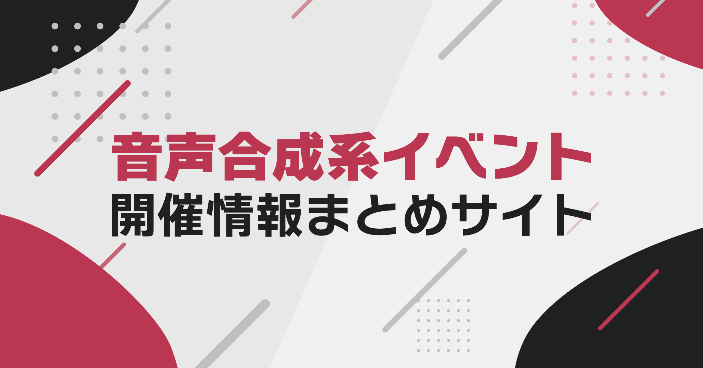

# Quince / 音声合成系イベント情報まとめサイト

> 音声合成系イベントの開催情報を非公式にまとめています。

## 情報提供について

### 掲載基準

- 日程がWeb上で一般公開されている同人誌即売会が対象です。
    - イベント内イベント(プチオンリーなど)も対象です。
- DJクラブイベントは、近郊で開催される即売会に合わせて開催されるもののみを掲載しています。

### 情報提供テンプレート

```
- イベント名: 
- ジャンル: 
- 開催日: 
- 会場名: 
- 備考: 
- WebサイトのURL: 
- 運営者名: 
- イベントの種類: 同人誌即売会 or DJクラブイベント
```

### GitHubの操作に慣れている方へ

- `assets/event-source.tsv` にてイベント情報を管理しています。(後述のデータ規則参照)
- このファイルを変更したプルリクエストを作成するか、[イベント情報提供用Issue](https://github.com/nectarition/Quince/issues/4)に上記の内容をコメントしてください。

### メールでも受け付けています

- `blossom@nectarition.jp` に上記の情報提供テンプレートを使用してメールを送信してください。

### データ規則

- タブ文字区切りファイル(TSV)で作成しています。
- データがない項目がある場合でも、その分タブで区切ってください。

| 必須 | 項目 | 内容 | 備考 |
| - | - | - | - |
| ＊ | イベント名 | イベントの正式名称 | 英数字は半角で入力する |
| ＊ | ジャンル | イベントのジャンル | キャラクター名＋オンリーを原則とする, キャラクターが2人以上いる場合、半角の中黒(`･`)で続ける, 合成音声オールジャンルは`all-genre`と入力する |
| ＊ | 日付 | イベントの初日開催日 | `xxxx-xx-xx` のフォーマットで入力する, 2日以上開催される場合はその日程を備考に入力する |
| ＊ | 会場名 | 会場の正式名称 | `都道府県名/会場名` のフォーマットで入力する, 部屋が分かっている場合は入力する, 英数字は半角で入力する |
| ＊ | 会場郵便番号 | 会場の郵便番号 | 半角・ハイフンなしで入力する | |
| ＊ | 会場住所 | 会場の住所 | 都道府県から入力する, 丁目以下はすべてハイフンで繋げる |
| | 備考 | 補足情報 | 併催の場合は `「イベント名」と併催` のフォーマットで入力, イベント内イベントの場合は `母体イベント名内開催` のフォーマットで入力 |
| ＊ | Webサイト | イベントの特設サイト等 | 開催日等が客観的にわかるサイトのURLを入力, Twitterでも可 |
| | 運営 | 運営団体の名称 | 原則開催概要に記載されている名称を記入, 不明な場合は空欄でも可 |
| ＊ | イベントタイプ | イベントの種類 | 同人誌即売会の場合は`fanzine`, DJクラブイベントの場合は`djclub` |

## サイト開発に関して

- サイトの生成にはAstroを使用しています。
- 開発用ドキュメントは現在準備中です。今しばらくお待ちください。
